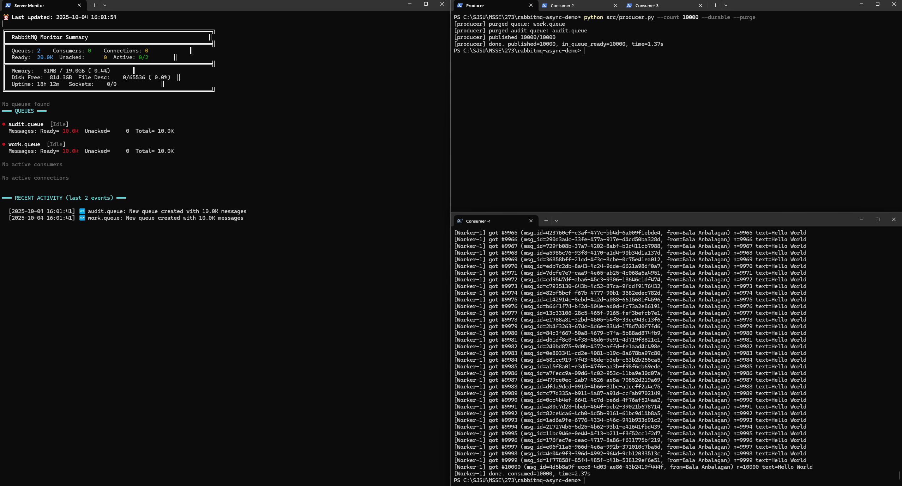

# Assignment 1: RabbitMQ Async Messaging - 10K Messages

**Student:** Bala Anbalagan
**Course:** CMPE 273
**Date:** 2025-10-04
**Assignment:** Basic RabbitMQ Producer-Consumer (10,000 messages)

---

## Objective

Demonstrate basic RabbitMQ async messaging with:
- Producer publishing 10,000 messages
- Consumer processing messages asynchronously
- Direct Exchange routing
- Dual queue pattern (work + audit)
- Manual acknowledgement for reliability

---

## Architecture

```
Producer → Direct Exchange (routing_key: "work") → Work Queue + Audit Queue
                                                         ↓              ↓
                                                   Consumer      Audit Log
```

**Components:**
- **Exchange:** `direct.exchange` (Direct type, durable)
- **Queues:**
  - `work.queue` - Processing queue (consumed by workers)
  - `audit.queue` - Audit trail (preserved for compliance)
- **Routing Key:** `work` (exact match for Direct Exchange)

---

## Test Execution

### Step 1: Start Monitor
```bash
python src/monitor.py
```

### Step 2: Publish 10,000 Messages
```bash
python src/producer.py --count 10000 --durable --purge
```

**Output:**
```
[producer] purged queue: work.queue
[producer] purged audit queue: audit.queue
[producer] published 10000/10000
[producer] done. published=10000, in_queue_ready=10000, time=1.55s
```

### Step 3: Consume Messages
```bash
python src/consumer.py --queue work.queue --name Worker-1
```

**Output:**
```
[Worker-1] got #9989 (msg_id=cf55bfe4-f006-408d-b8ed-4290fb9e5d3f, from=Bala Anbalagan) n=9989 text=Hello World
[Worker-1] got #9990 (msg_id=3b05b435-07eb-45e8-b6d1-7942af4b108b, from=Bala Anbalagan) n=9990 text=Hello World
...
[Worker-1] got #9999 (msg_id=a14e8c3b-7394-4a0d-ac22-573a95a0a087, from=Bala Anbalagan) n=9999 text=Hello World
[Worker-1] got #10000 (msg_id=8c0d4a70-29b6-4ac7-9676-4e2745395205, from=Bala Anbalagan) n=10000 text=Hello World
[Worker-1] done. consumed=10000, time=2.39s
```

---

## Test Screenshot



---

## Performance Results

| Metric | Value |
|--------|-------|
| **Messages Published** | 10,000 |
| **Publish Time** | 1.55 seconds |
| **Publish Rate** | ~6,451 msg/sec |
| **Messages Consumed** | 10,000 |
| **Consume Time** | 2.39 seconds |
| **Consume Rate** | ~4,184 msg/sec |
| **Message Loss** | 0 (ZERO) |
| **Acknowledgement** | Manual (reliable) |

---

## Monitor Dashboard

**During Publishing:**
```
╔═════════════════════════════════════════════════════════════════╗
║  RabbitMQ Monitor Summary                                      ║
╠═════════════════════════════════════════════════════════════════╣
║  Queues: 2    Consumers: 0    Connections: 1             ║
║  Ready:  10.0K  Unacked:      0  Active: 2/2        ║
╚═════════════════════════════════════════════════════════════════╝

━━━ QUEUES ━━━

● audit.queue  [Idle]
  Messages: Ready= 10.0K  Unacked=     0  Total= 10.0K

● work.queue  [Idle]
  Messages: Ready= 10.0K  Unacked=     0  Total= 10.0K
```

**After Consumption:**
```
● audit.queue  [Idle]
  Messages: Ready= 10.0K  Unacked=     0  Total= 10.0K

● work.queue  [Idle]
  Messages: Ready=     0  Unacked=     0  Total=     0

━━━ RECENT ACTIVITY (last 3 events) ━━━

  [2025-10-04 14:13:03] 🆕 audit.queue: New queue created with 10.0K messages
  [2025-10-04 14:13:03] 🆕 work.queue: New queue created with 10.0K messages
  [2025-10-04 14:13:40] 📤 work.queue: -10.0K messages consumed
```

---

## Message Format

Each message includes metadata:

```json
{
  "headers": {
    "message_id": "8c0d4a70-29b6-4ac7-9676-4e2745395205",
    "timestamp": "2025-10-04T14:13:35",
    "producer_id": "Bala Anbalagan",
    "host": "iBalaSurface3"
  },
  "properties": {
    "delivery_mode": 2,
    "content_type": "text/plain"
  },
  "body": {
    "n": 10000,
    "text": "Hello World"
  }
}
```

---

## Key Features Demonstrated

### 1. **Async Messaging**
- Producer publishes and exits (1.55s)
- Messages wait in queue
- Consumer processes when ready (2.39s)
- Decoupled producer/consumer timing

### 2. **Reliability (Manual Acknowledgement)**
- Consumer only ACKs after successful processing
- Messages redelivered if consumer crashes
- Zero message loss guaranteed

### 3. **Dual Queue Pattern**
- Same message routed to both queues
- `work.queue` - consumed and emptied
- `audit.queue` - preserved for audit/debugging
- One producer, multiple destinations

### 4. **Durable Queues**
- Survive RabbitMQ broker restarts
- Messages persist to disk
- Enabled with `--durable` flag

---

## Exchange and Bindings

### Exchange Declaration
```python
ch.exchange_declare(exchange="direct.exchange", exchange_type="direct", durable=True)
```

### Queue Bindings
```python
ch.queue_bind(queue="work.queue", exchange="direct.exchange", routing_key="work")
ch.queue_bind(queue="audit.queue", exchange="direct.exchange", routing_key="work")
```

### Verification
```bash
rabbitmqctl list_bindings
# Output:
# direct.exchange -> work.queue (routing_key: work)
# direct.exchange -> audit.queue (routing_key: work)
```

---

## Error Handling

**Fixed Issue:** Consumer AttributeError
- **Problem:** `method.channel.basic_ack()` failed
- **Cause:** `method` is a `Deliver` object, not a channel
- **Solution:** Changed to `ch_cb.basic_ack(delivery_tag=method.delivery_tag)`
- **Result:** All 10K messages processed successfully

---

## Verification Commands

```bash
# List queues with message counts
rabbitmqctl list_queues name messages

# List exchanges
rabbitmqctl list_exchanges name type

# List bindings
rabbitmqctl list_bindings

# Purge queues
rabbitmqctl purge_queue work.queue
rabbitmqctl purge_queue audit.queue

# Delete queues
rabbitmqctl delete_queue work.queue
rabbitmqctl delete_queue audit.queue
```

---

## Cleanup

### Command
```bash
# PowerShell
.\scripts\cleanup_queues.ps1 -All

# Linux/Mac
./scripts/cleanup_queues.sh all
```

### Cleanup Output


**Summary:**
- Successfully deleted all queues
- Clean environment ready for next test
- Built-in exchanges (amq.*) preserved automatically

---

## Conclusion

✓ Successfully published 10,000 messages in 1.55 seconds
✓ Successfully consumed 10,000 messages in 2.39 seconds
✓ Zero message loss with manual acknowledgement
✓ Dual queue pattern working (work + audit)
✓ Direct Exchange routing correctly
✓ Durable queues persist messages
✓ Real-time monitoring operational

**Result:** Assignment completed successfully with reliable async messaging demonstrated.

---

## Repository

**GitHub Repository:** [https://github.com/BalaAnbalagan/rabbitmq-async-demo](https://github.com/BalaAnbalagan/rabbitmq-async-demo)
**LinkedIn:** [Bala Anbalagan](https://www.linkedin.com/in/basisbala/)
**Email:** bala.anbalagan@sjsu.edu

---

*RabbitMQ 4.1.4 | Python 3.x | Pika 1.3.2*
