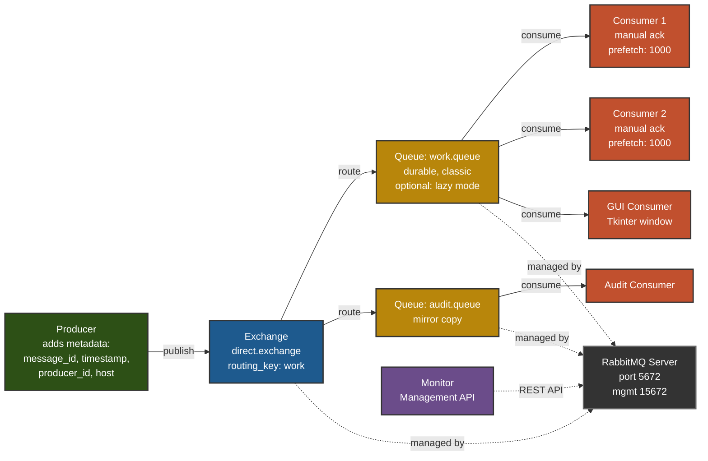

# RabbitMQ Async Messaging Demo

A **production-ready** mini-project demonstrating asynchronous messaging with RabbitMQ:
- **Producer** adds metadata (who sent it), publishes to a **direct exchange**
- **Terminal Consumer(s)** with **manual acknowledgements** and **prefetch** for reliability
- **GUI Consumer window** (Tkinter) that displays messages live
- **Server Monitor** with **card-style UI** using RabbitMQ Management API (color-coded status, `--watch` for live refresh)

Perfect for learning RabbitMQ concepts: async reliability, message persistence, lazy queues, and stress testing.

## Use Cases

### Reliability Testing — 10,000 messages
Demonstrates asynchronous decoupling and zero message loss:
1) Start RabbitMQ and enable the Management UI
2) Run the **producer** for 10,000 messages while consumer is **offline**
3) Verify the queue shows ~10,000 **Ready** messages
4) Start the **consumer** and verify it processes exactly **10,000** (no loss)

### Stress Testing — 1,000,000 messages
Demonstrates scalability with disk-backed lazy queues:
1) Produce **1,000,000** messages to a **disk-backed (lazy)** durable queue
2) Consume them all with higher **prefetch** (e.g., 5000) for throughput
3) Verify counts match (no loss)

---

## Quick Start (Windows / macOS / Linux)

### 1) Start RabbitMQ + Management UI

- **Windows (as service or installer):** Ensure the service is running.
  Enable UI (Admin PowerShell):
  ```powershell
  "C:\Program Files\RabbitMQ Server\rabbitmq_server-4.1.4\sbin\rabbitmq-plugins.bat" enable rabbitmq_management
  ```

  **Management UI:** http://localhost:15672
  **Default Login:**
  - Username: `guest`
  - Password: `guest`

- **Docker (cross-platform):**
  ```bash
  docker run -d --name rabbitmq -p 5672:5672 -p 15672:15672 rabbitmq:3.13-management
  ```

  **Management UI:** http://localhost:15672
  **Default Login:**
  - Username: `guest`
  - Password: `guest`

### 2) Install Python dependencies
```bash
python -m pip install -r requirements.txt
```

**Requirements:**
- `pika` - RabbitMQ client library
- `requests` - For Management API calls
- `tkinter` - GUI consumer (pre-installed on Windows/macOS; Linux: `sudo apt-get install python3-tk`)

### 3) Reliability Test (10k messages)

**Step 1: Produce messages (consumer offline)**
```bash
python src/producer.py --count 10000 --durable --purge
```
**Expected output:** `published=10000, in_queue_ready≈10000`

**Step 2: Verify in Management UI**
- Navigate to http://localhost:15672
- Check **Queues → work.queue** shows ~10,000 Ready messages

**Step 3: Consume messages**
```bash
python src/consumer.py --name Worker-1 --expect 10000
```
**Expected output:** `consumed=10000, time=X.XXs` (queue empties to zero)

**✅ Success criteria:** All 10,000 messages consumed with no loss (demonstrates async decoupling)

### 4) Stress Test (1M messages)

**Step 1: Produce 1 million messages** (disk-backed lazy queue)
```bash
python src/producer.py --queue work.queue.1m --audit-queue audit.queue.1m --count 1000000 --durable --lazy --purge --progress-every 50000
```
**Expected:** Progress updates every 50K messages, final output shows `published=1000000`

**Step 2: Consume 1 million messages** (high prefetch for throughput)
```bash
python src/consumer.py --queue work.queue.1m --name Worker-1M --prefetch 5000 --expect 1000000 --progress-every 50000 --lazy
```
**Expected:** Progress updates every 50K, completes with `consumed=1000000` and queue empties

**✅ Success criteria:** All 1M messages consumed with no loss (demonstrates scalability with lazy queues)

---

## Additional Tools

### GUI Consumer (optional)
View messages in a live Tkinter window:
```bash
python src/consumer_gui.py --queue work.queue --name Window-1
```

### Monitor Dashboard (recommended)
Beautiful card-style monitor with **real-time activity tracking** and **auto-refresh**:
```bash
python src/monitor.py
```
**Features:**
- 📊 **Queue status** (green/yellow/red indicators based on depth)
- 🔄 **Real-time activity** - Shows Publishing ⬆ / Consuming ⬇ / Idle states
- 📈 **Message rates** - Pub/Del/Ack per second when active
- ✓ **Consumer count** per queue
- 👥 Active consumers with connection details
- 🔌 Connection list
- ⏰ Auto-refresh every 3 seconds (default)
- 📏 Large number formatting (10K, 1.5M)
- ✨ Smooth updates without screen flicker

**Example Output:**
```
╔═══════════════════════════════════════════════════════════════╗
║  RabbitMQ Monitor Summary                                     ║
╠═══════════════════════════════════════════════════════════════╣
║  Queues: 2    Consumers: 1    Connections: 2                  ║
║  Ready:  5.2K  Unacked:    500  Active: 1/2                   ║
╚═══════════════════════════════════════════════════════════════╝

📊 QUEUES
───────────────────────────────────────────────────────────────────
● work.queue  [⬇ Consuming]
  Messages: Ready=  5.2K  Unacked=   500  Total=  5.7K
  Activity: Del=250.5/s  Ack=250.5/s
  ✓ 1 active consumer(s)

● audit.queue  [Idle]
  Messages: Ready= 10.0K  Unacked=     0  Total= 10.0K
```

**Options:**
- `python src/monitor.py` - Auto-refresh every 3 seconds (default)
- `python src/monitor.py --watch 10` - Custom refresh interval
- `python src/monitor.py --once` - Run once and exit

---

## What this repo shows

- **Asynchronous** decoupling: producer fills the queue while consumers are offline; messages remain **Ready**.
- **Reliability**: **manual ack** + durable queues + persistent messages → no loss.
- **Scalability**: **lazy queues** store messages on disk (safe for 1M).
- **Backpressure**: consumer **prefetch** controls load.
- **Metadata**: messages carry `message_id`, `timestamp`, and headers (`producer_id`, `host`), so you can display “who sent it”.

---

## Architecture & Flow

### Message Flow Diagram



### Topology Details

**Exchange: The Message Router**

An **Exchange** is RabbitMQ's message router - producers never send messages directly to queues. Instead, they publish to an exchange, which routes messages to queues based on rules.

**Our Exchange Configuration:**
- Type: **Direct Exchange**
- Name: `direct.exchange`
- Durable: Yes (survives broker restarts)
- Routing Key: `work`

**How Direct Exchange Works:**

```
Producer publishes with routing_key="work"
         ↓
   direct.exchange (checks routing key)
         ↓
    Bindings:
    - work.queue    bound with key "work" ✓ (matches!)
    - audit.queue   bound with key "work" ✓ (matches!)
         ↓
   Message copied to BOTH queues
```

**Key Concept:** One message → Multiple queues (fan-out pattern)

**Why Use an Exchange Instead of Direct Queue Publishing?**

1. **Flexibility** - Change routing without touching producer code
2. **Fan-out** - Send same message to multiple queues
3. **Decoupling** - Producer doesn't know about queues
4. **Filtering** - Route based on criteria (routing keys)

**Other Exchange Types (not used in this demo):**
- **Fanout** - Broadcasts to ALL bound queues (ignores routing key)
- **Topic** - Pattern matching (e.g., `logs.*.error`)
- **Headers** - Routes based on message headers

**Queues:**
- **work.queue** - Main processing queue (consumed by workers)
- **audit.queue** - Mirror/audit copy (for logging, monitoring, or compliance)
- Both: **classic**, **durable**
- Optional: **x-queue-mode=lazy** for 1M+ messages (disk-backed)

**Why Two Queues with Same Routing Key?**

The same message is routed to both queues using the same routing key. This demonstrates a common pattern:
- **work.queue** - Active processing by consumers
- **audit.queue** - Audit trail, compliance logging, or debugging (consumed separately or kept as history)

This pattern is useful for:
- 📊 Monitoring message flow without affecting workers
- 🔍 Debugging production issues by replaying audit messages
- 📝 Compliance/audit requirements
- 🔄 Dead-letter or backup scenarios

**To verify the exchange and bindings:**
```bash
# View exchanges
rabbitmqctl list_exchanges

# View bindings
rabbitmqctl list_bindings

# You'll see:
# direct.exchange -> work.queue (routing_key: work)
# direct.exchange -> audit.queue (routing_key: work)
```

**Consumers:**
- Manual **acknowledgement** (reliable, no message loss)
- **Prefetch** control (backpressure, default: 1000)
- Can run multiple consumers in parallel

**Message Metadata:**
- `message_id` - UUID for each message
- `timestamp` - Unix timestamp
- `producer_id` - Username of producer (from `getpass.getuser()`)
- `host` - Hostname of producer machine

---

## Command Reference

### Producer Options
```bash
python src/producer.py [OPTIONS]
```
| Option | Default | Description |
|--------|---------|-------------|
| `--host` | localhost | RabbitMQ server host |
| `--queue` | work.queue | Queue name |
| `--audit-queue` | audit.queue | Audit/mirror queue name |
| `--count` | 10000 | Number of messages to publish |
| `--durable` | False | Create durable queue (survives restarts) |
| `--lazy` | False | Use lazy queue (disk-backed for large volumes) |
| `--purge` | False | Purge both queues before publishing (cleans old data) |
| `--progress-every` | 10000 | Show progress every N messages |
| `--producer-id` | (current user) | Producer identifier (defaults to your username) |
| `--text` | Hello World | Message text content |

**Notes:**
- The producer automatically adds your Windows/Unix username as `producer_id` in message headers. This is visible in consumer output as `from=YourUsername`.
- Using `--purge` cleans **both** work and audit queues to ensure a fresh start (recommended for testing).

### Consumer Options
```bash
python src/consumer.py [OPTIONS]
```
| Option | Default | Description |
|--------|---------|-------------|
| `--host` | localhost | RabbitMQ server host |
| `--queue` | work.queue | Queue to consume from |
| `--name` | Worker | Consumer name (for identification) |
| `--prefetch` | 1000 | Prefetch count (backpressure control) |
| `--expect` | None | Auto-stop after N messages |
| `--lazy` | False | Match lazy queue settings |
| `--progress-every` | 10000 | Show progress every N messages |

### Monitor Options
```bash
python src/monitor.py [OPTIONS]
```
| Option | Default | Description |
|--------|---------|-------------|
| `--host` | http://localhost:15672 | Management API URL |
| `--watch` | 3 | Auto-refresh every N seconds (0=run once) |
| `--once` | False | Run once and exit (same as --watch 0) |
| `--username` | guest | Management API username |
| `--password` | guest | Management API password |

---

## RabbitMQ CLI Operations

### Quick Cleanup Scripts

For easy queue management, use the provided cleanup scripts:

**Windows (PowerShell):**

```powershell
# Delete ALL queues and exchanges (complete reset)
.\scripts\cleanup_queues.ps1 -All

# Delete only unused exchanges (keeps built-in amq.*)
.\scripts\cleanup_queues.ps1 -Exchanges

# Delete specific queue(s)
.\scripts\cleanup_queues.ps1 -Queue work.queue
.\scripts\cleanup_queues.ps1 -Queue work.queue,audit.queue
```

**If you get "running scripts is disabled" error:**
```powershell
# Method 1: Bypass for this script only
powershell -ExecutionPolicy Bypass -File .\scripts\cleanup_queues.ps1 -All

# Method 2: Enable permanently (run once)
Set-ExecutionPolicy -ExecutionPolicy RemoteSigned -Scope CurrentUser
```

**Linux/Mac (Bash):**
```bash
# Make executable first
chmod +x scripts/cleanup_queues.sh

# Delete ALL queues and exchanges
./scripts/cleanup_queues.sh all

# Delete only unused exchanges
./scripts/cleanup_queues.sh exchanges

# Delete specific queue(s)
./scripts/cleanup_queues.sh work.queue
./scripts/cleanup_queues.sh work.queue audit.queue
```

### Manual Queue Management

**List all queues:**
```bash
rabbitmqctl list_queues name messages_ready messages_unacknowledged messages
```

**Purge a queue (empty it, keep the queue):**
```bash
rabbitmqctl purge_queue work.queue
rabbitmqctl purge_queue audit.queue
```

**Delete a queue completely:**
```bash
rabbitmqctl delete_queue work.queue
rabbitmqctl delete_queue audit.queue
```

**Clean up old/test queues:**
```bash
# Delete old cmpe273.* queues if migrating from old version
rabbitmqctl delete_queue cmpe273.work
rabbitmqctl delete_queue cmpe273.audit

# Delete any test queues
rabbitmqctl delete_queue hello
```

**Fix PRECONDITION_FAILED errors:**
If you see `PRECONDITION_FAILED - inequivalent arg 'durable'` or `'x-queue-mode'`:
```bash
# Delete the queue and let producer recreate it with correct settings
rabbitmqctl delete_queue work.queue
python src/producer.py --count 100 --durable --purge
```

**View connections:**
```bash
rabbitmqctl list_connections name user
```

**View consumers:**
```bash
rabbitmqctl list_consumers queue_name consumer_tag channel_name
```

---

## Troubleshooting

### PowerShell Script Execution Error (Windows)
**Problem:** `cannot be loaded because running scripts is disabled on this system`

**Solution:**
```powershell
# Quick fix - bypass for single script
powershell -ExecutionPolicy Bypass -File .\scripts\cleanup_queues.ps1 -All

# Permanent fix - enable for current user
Set-ExecutionPolicy -ExecutionPolicy RemoteSigned -Scope CurrentUser
```

### PRECONDITION_FAILED Error
**Problem:** `PRECONDITION_FAILED - inequivalent arg 'durable'` or `'x-queue-mode'`

**Cause:** Queue already exists with different settings (durable/lazy mismatch)

**Solutions:**
1. Delete the queue: `rabbitmqctl delete_queue work.queue`
2. Use a different queue name: `--queue work.queue.new`
3. Match existing settings (remove `--lazy` or `--durable`)

### Consumer AttributeError Fixed
**Fixed in latest version:** Changed `method.channel.basic_ack()` to `ch_cb.basic_ack()` in [consumer.py:71](src/consumer.py#L71)

### GUI Consumer Not Starting
- **Windows/macOS:** Tkinter is pre-installed
- **Linux:** Install with `sudo apt-get install python3-tk`

### Monitor Not Showing Data
- Ensure Management plugin is enabled: `rabbitmq-plugins enable rabbitmq_management`
- Check UI is accessible: http://localhost:15672
- Verify credentials (default: guest/guest)

---

---

## Author

**Bala Anbalagan**
- GitHub: [@BalaAnbalagan](https://github.com/BalaAnbalagan)
- LinkedIn: [Bala Anbalagan](https://www.linkedin.com/in/basisbala/)
- Email: balamuralikrishnan.anbalagan@gmail.com

---

## Acknowledgments

This project demonstrates RabbitMQ messaging patterns including:
- Asynchronous message processing with manual acknowledgments
- Lazy queue implementation for high-volume scenarios
- Producer-consumer pattern with prefetch control
- Management API integration for monitoring

Built as a learning project for distributed messaging systems.

---

## License

MIT License

Copyright (c) 2025 Bala Anbalagan

Permission is hereby granted, free of charge, to any person obtaining a copy
of this software and associated documentation files (the "Software"), to deal
in the Software without restriction, including without limitation the rights
to use, copy, modify, merge, publish, distribute, sublicense, and/or sell
copies of the Software, and to permit persons to whom the Software is
furnished to do so, subject to the following conditions:

The above copyright notice and this permission notice shall be included in all
copies or substantial portions of the Software.

THE SOFTWARE IS PROVIDED "AS IS", WITHOUT WARRANTY OF ANY KIND, EXPRESS OR
IMPLIED, INCLUDING BUT NOT LIMITED TO THE WARRANTIES OF MERCHANTABILITY,
FITNESS FOR A PARTICULAR PURPOSE AND NONINFRINGEMENT. IN NO EVENT SHALL THE
AUTHORS OR COPYRIGHT HOLDERS BE LIABLE FOR ANY CLAIM, DAMAGES OR OTHER
LIABILITY, WHETHER IN AN ACTION OF CONTRACT, TORT OR OTHERWISE, ARISING FROM,
OUT OF OR IN CONNECTION WITH THE SOFTWARE OR THE USE OR OTHER DEALINGS IN THE
SOFTWARE.
